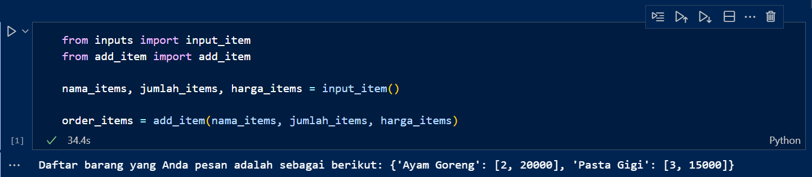
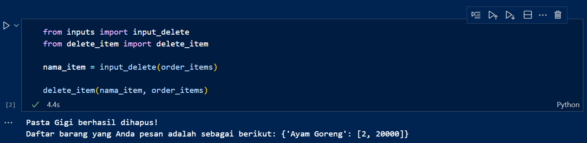
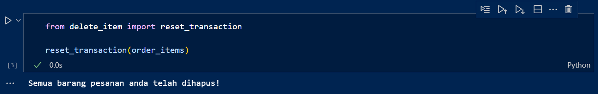
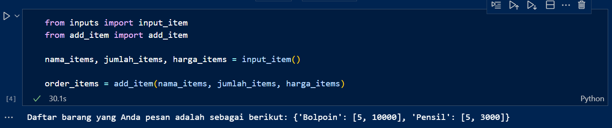
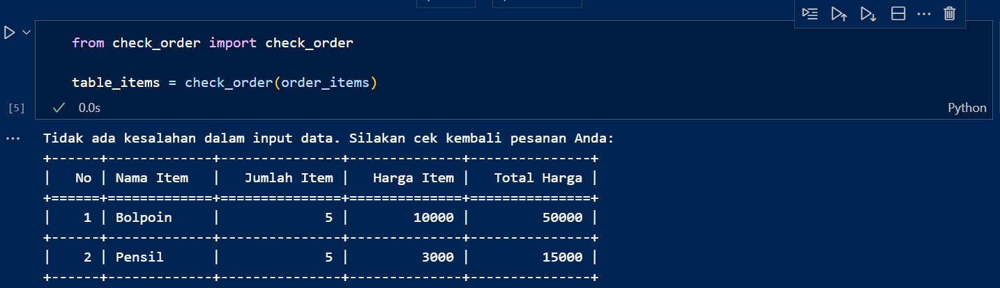
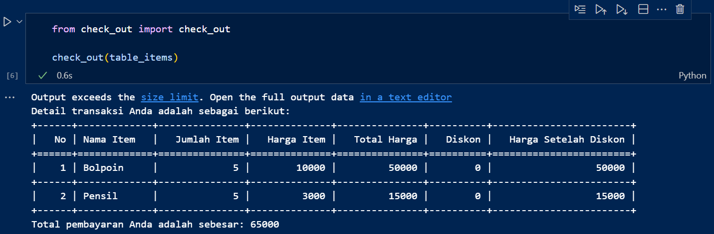
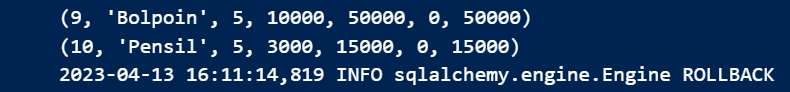

# Self-service Cashier

__Self-service Cashier__ is a Python-based program designed to allow customers to enter items, along with their respective quantities and prices, into an order list. This information is then stored in an SQLite database.

## Background Scenario

The owner of a large supermarket in a city in Indonesia has a plan to improve business processes by creating a self-service cashier system with the following objectives:

- Allowing customers to directly enter the items they purchase, along with the quantity and price of each item, along with several other features.
- Enabling customers who are not in the city to buy goods from the supermarket.

## Requirements

The Self-service Cashier program requires the following features:

1. Customers can enter the name, quantity, and price of items into the order list.
2. Customers can update the name, quantity, and price of previously entered items.
3. Customers can delete any or all items from the order list.
4. Customers can review the list of orders they have made.
5. Customers can receive discounts if they meet the purchase conditions.
6. Customers can view the total payment for all transactions.
7. The program can store order data into the database.

## Program Scheme


### START

1. The customer will be prompted to enter the item name, item quantity, and item price sequentially using the `input_item()` function. `input_item()` will then check if the customer still wants to add items to the order. If they do, the customer will be asked to enter the next item's name, quantity, and price. Once the customer has finished entering items, `input_item()` will stop functioning and return the item name, quantity, and price values in the form of a list
2. The list of item names, quantities, and prices is processed by the `add_item()` function, which pairs the items and their details into the order_items dictionary.
3. If the customer wants to modify the data in the order, they can use the __update__ feature. There are three update options available:
    - Item name update: `input_update_name()` will prompt the customer to enter the previous item name and the new item name to replace it. `update_item_name()` will then change the item name in `order_items` based on the customer's input.
    - Update item quantity: `input_update_qty()` will prompt the customer to enter the name of the item for which they want to change the quantity and the new number of items. `update_item_qty()` will then adjust the quantity of items in `order_items` according to the customer's input.
    - Item price update: `input_update_price()` will prompt the customer to enter the name of the item for which they want to change the price and the new price of the item. `update_item_price()` will then modify the price of the items in `order_items` based on the customer's input.
4. If a customer wants to delete data from an order, they can use the __delete__ feature. There are two delete options available:
    - Delete per item: `input_delete()` will prompt the customer to enter the name of the item to be deleted. `delete_item()` will then remove the specified items from order_items based on the customer's input.
    - Delete all items: the `reset_transaction()` method will delete all contents of `order_items`.
    - Customers can add items back via `input_item()`.
5. Customers can check the items that have been ordered through the `check_order()` function, which ensures there are no input errors. If any errors are detected, an error message is displayed, and the customer is redirected to `input_item()`. If there are no errors, the order data is returned in `table_items`, which contains the following fields:
    - Item name
    - Number of items
    - Price per item
    - Total price
6. If the customer finds no errors in the order list, they can proceed to check out via the `check_out()` function. `check_out()` will return the order data, and the customer will receive the following discounts:
    - 5% if the total price is more than 200,000,
    - 6% if the total price is more than 300,000,
    - 7% if the total price is more than 500,000.

    The order data will include the `table_items` with additional columns:
    - Discount
    - Price after discount

    The total payment of all items will be displayed. Finally, `check_out()` will call the `insert_to_table()` function to insert the data into the database.

### END

## Code Explanation

### inputs.py

The `inputs` module is a collection of functions that request input from the customer.

- The `input_item()` function prompts the customer to enter the name, quantity, and price of the item as long as they wish to continue adding items to the order. This function utilizes the `input_int()` function to handle `ValueError` when inputting integer values.

```py
def input_int(prompt: str):
    while True:
        try: 
            return int(input(prompt))
        except ValueError as error:
            print(f'{error}. Mohon untuk memasukkan angka. Silakan coba lagi')
```

```py
def input_item():
    want_to_order = True
    nama_items = []
    jumlah_items = []
    harga_items = []

    while want_to_order:
        nama_item = input('Masukkan nama barang yang ingin dipesan: ').lower()
        
        while nama_item == '':
            print('Nama barang tidak boleh kosong. Silakan coba lagi.')
            nama_item = input('Masukkan nama barang yang ingin dipesan: ').lower()
        
        jumlah_item = input_int(f'Masukkan jumlah {nama_item} yang ingin dipesan: ')

        while jumlah_item <= 0:
            print(f'Jumlah {nama_item} harus lebih dari 0. Silakan coba lagi.')
            jumlah_item = input_int(f'Masukkan jumlah {nama_item} yang ingin dipesan: ')

        harga_item = input_int(f'Masukkan harga {nama_item} yang ingin dipesan: ')

        while jumlah_item <= 0:
            print(f'Harga {nama_item} harus lebih dari 0. Silakan coba lagi.')
            harga_item = input_int(f'Masukkan harga {nama_item} yang ingin dipesan: ')

        nama_items.append(nama_item)
        jumlah_items.append(jumlah_item)
        harga_items.append(harga_item)

        while True:
            order_again = input('Apakah masih ada yang ingin dipesan (Ya/Tidak)? ').lower()
            if order_again == 'ya':
                break
            elif order_again == 'tidak':
                want_to_order = False
                break
            else:
                print('Perintah yang Anda masukkan salah. Silakan coba lagi')
    
    return nama_items, jumlah_items, harga_items
```

As long as the value of `want_to_order` is `True`, the input process is executed, and the values are entered into the `name_item`, `amount_item`, and `price_item`.

The `name_item` is obtained using the built-in function `input()`, and before inserting it into the list, it is ensured that it is not empty. `amount_item` and `price_item` are obtained using `input_int()` function, which also ensures that the values are greater than 0.

Then, it is checked if the customer wants to add more items to the order or not: if yes, the loop returns to the beginning; otherwise, `want_to_order` is set to `False`, and the loop stops.

Once all items are inputted, the function returns a list of `items_name`, `items_amount`, and `items_price`.

- The `input_update()` function requests input for the name of the item whose data the customer wants to update. Then, `input_update()` verifies if the item name is present in `order_items`. If it is found, the function returns `item_name`.

```py
def input_update(prompt: str, order_items: dict):
    nama_item = (input(prompt)).title()

    while nama_item not in order_items:
        print(f'Barang tidak ada dalam daftar pesanan Anda: {list(order_items.keys())}. Silakan coba lagi.')
        nama_item = (input(prompt)).title()
    
    return nama_item
```

- The `input_update_name()`, `input_update_qty()`, `input_update_price()`, and `input_delete()` functions receive inputs from the `input_update()` function.

`input_update_name()` returns the current `item_name` and the new item name inputted by the customer.

```py
def input_update_name(order_items: dict):
    nama_item = input_update('Masukkan nama barang yang ingin diupdate: ', order_items)
    update_nama_item = (input('Masukkan nama barang yang baru: ')).title()

    while update_nama_item == '':
            print('Nama barang yang baru tidak boleh kosong. Silakan coba lagi.')
            update_nama_item = input('Masukkan nama barang yang baru: ').title()

    while update_nama_item == nama_item:
        print(f'Nama barang yang baru tidak boleh sama dengan sebelumnya: {nama_item}')
        update_nama_item = (input('Masukkan nama barang yang baru: ')).title()
    
    return nama_item, update_nama_item
```

`input_update_qty()` returns the `item_name` and the new quantity inputted by the customer.

```py
def input_update_qty(order_items: dict):
    nama_item = input_update('Masukkan nama barang yang jumlahnya ingin diupdate: ', order_items)
    update_jumlah_item = input_int(f'Masukkan jumlah {nama_item.lower()} yang baru: ')

    while update_jumlah_item <= 0:
            print(f'Jumlah {nama_item} harus lebih dari 0. Silakan coba lagi.')
            update_jumlah_item = input_int(f'Masukkan jumlah {nama_item} yang baru: ')

    while update_jumlah_item == order_items[nama_item][0]:
        print(f'Jumlah {nama_item.lower()} tidak boleh sama dengan sebelumnya: {order_items[nama_item][0]}')
        update_jumlah_item = input_int(f'Masukkan jumlah {nama_item.lower()} yang baru: ')
    
    return nama_item, update_jumlah_item
```

`input_update_price()` returns the `item_name` and the new price inputted by the customer.

```py
def input_update_price(order_items: dict):
    nama_item = input_update('Masukkan nama barang yang harganya ingin diupdate: ', order_items)
    update_harga_item = input_int(f'Masukkan harga {nama_item.lower()} yang baru: ')

    while update_harga_item <= 0:
            print(f'Harga {nama_item} harus lebih dari 0. Silakan coba lagi.')
            update_harga_item = input_int(f'Masukkan harga {nama_item} yang baru: ')

    while update_harga_item == order_items[nama_item][1]:
        print(f'Harga {nama_item.lower()} tidak boleh sama dengan sebelumnya: {order_items[nama_item][1]}')
        update_harga_item = input_int(f'Masukkan harga {nama_item.lower()} yang baru: ')
    
    return nama_item, update_harga_item
```

`input_delete()` returns the name of the item whose data the customer wants to delete.

```py
def input_delete(order_items: dict):
    return input_update('Masukkan nama barang yang ingin dihapus: ', order_items)
```

### add_item.py

The `add_item` module contains only one function, which is responsible for inserting the return from `input_item()` into the dictionary.

The `add_item()` function accepts arguments in the form of lists `name_items`, `amount_items`, and `price_items`, and returns them in the form of a dictionary `order_items`, where the key is `name_item`, and the value is a list containing `amount_item` and `price_item`.

```py
def add_item(nama_items: list, jumlah_items: list, harga_items: list):
    order_items = {}
    
    for i in range(len(nama_items)):
        order_items[nama_items[i].title()] = [jumlah_items[i], harga_items[i]]
    
    print(f'Daftar barang yang Anda pesan adalah sebagai berikut: {order_items}')

    return order_items
```

### update_item.py

The `update_item` module contains functions that receive inputs from update functions based on the details of the item to be updated.

- `update_item_name()` accepts `item_name`, `update_item_name`, and `order_items` as arguments, and then replaces the `item_name` key inside `order_items` with the `update_item_name` key.

```py
def update_item_name(nama_item: str, update_nama_item: str, order_items: dict):
    try:
        order_items[update_nama_item] = order_items.pop(nama_item)

        print(f'{update_nama_item} berhasil ditambahkan!\n'
        f'Daftar barang yang Anda pesan adalah sebagai berikut: {order_items}')
    except KeyError as error:
        print(f'{update_nama_item} gagal ditambahkan. {error}. Silakan coba lagi.')
```

- `update_item_qty()` accepts `item_name`, `update_item_number`, and `order_items` as arguments, then replaces the quantity of `item_name` in `order_items` with `update_item_number`.

```py
def update_item_qty(nama_item: str, update_jumlah_item: int, order_items: dict):
    try:
        order_items[nama_item][0] = update_jumlah_item
        
        print(f'Jumlah {nama_item.lower()} berhasil diubah!\n'
        f'Daftar barang yang Anda pesan adalah sebagai berikut: {order_items}')
    except KeyError as error:
        print(f'Pergantian jumlah {nama_item.lower()} gagal. {error}. Silakan coba lagi.')
```

- `update_item_price()` accepts `item_name`, `update_item_price`, and `order_items` as arguments, then replaces the price of `item_name` in `order_items` with `update_item_price`.

```py
def update_item_price(nama_item: str, update_harga_item: int, order_items: dict):
    try:
        order_items[nama_item][0] = update_jumlah_item
        
        print(f'Jumlah {nama_item.lower()} berhasil diubah!\n'
        f'Daftar barang yang Anda pesan adalah sebagai berikut: {order_items}')
    except KeyError as error:
        print(f'Pergantian jumlah {nama_item.lower()} gagal. {error}. Silakan coba lagi.')
```

### delete_item.py

The `delete_item` module contains functions that will remove data from `order_items`.

- The `delete_item()` function accepts `item_name` and `order_items` as arguments, and then removes a row of data inside `order_items` with the key `item_name`.

```py
def delete_item(nama_item: str, order_items: dict): 
    try:
        order_items.pop(nama_item)

        print(f'{nama_item} berhasil dihapus!\n'
              f'Daftar barang yang Anda pesan adalah sebagai berikut: {order_items}')
    except KeyError as error:
        print(f'Penghapusan gagal. {error}. Silakan coba lagi.')
```

- The `reset_transaction()` function accepts `order_items` as an argument and then clears its contents.

```py
def reset_transaction(order_items: dict):
    order_items.clear()

    if len(order_items) == 0:
        print('Semua barang pesanan anda telah dihapus!')
```

### check_order.py

The `check_order` module contains a function that accepts `order_items` as an argument and displays it in tabular form with the help of the `tabulate` library.

```py
from tabulate import tabulate

def check_order(order_items: dict):
    for key, value in order_items.items():
        if key == '' or len(value) != 2 or 0 in value or None in value:
            print('Terdapat kesalahan dalam input data. Silakan coba lagi.')
            return
```

First, it checks if there is missing data from `order_items` and will display an error message if:

- there is an empty key
- there are missing item quantities or prices
- there is an item quantity or price that has a value of 0 or None.

```py
    table_items = {}
    table_items['No'] = [i + 1 for i in range(len(order_items))]
    table_items['Nama Item'] = list(order_items.keys())
    table_items['Jumlah Item'] = [list(order_items.values())[i][0] for i in range(len(order_items))]
    table_items['Harga Item'] = [list(order_items.values())[i][1] for i in range(len(order_items))]
    table_items['Total Harga'] = (
        [(list(order_items.values())[i][0]) * (list(order_items.values())[i][1]) 
        for i in range(len(order_items))]
    )

    print('Tidak ada kesalahan dalam input data. Silakan cek kembali pesanan Anda:')
    print(tabulate(table_items, headers='keys', tablefmt='grid'))

    return table_items
```

If there are no errors, the data in `order_items` will be transformed into `table_items` with the following columns:

- No.
- Item Name
- Number of Items
- Item Prices
- Total Price (Item Price multiplied by Number of Items)

Lastly, it displays no error message and shows `table_items` in tabular form using `tabulate`, and then returns `table_items`.

### check_out.py

The `check_out` module contains a function that accepts `table_items` as an argument and then inserts it into the SQLite database with the help of the function from the `insert_to_table` module.

```py
from tabulate import tabulate
from insert_to_table import insert_to_table

def check_out(table_items: dict):
    diskon = []
    harga_diskon = []

        for i in range(len(table_items['No'])):
        diskon_per_item = 0
        if table_items['Total Harga'][i] > 500_000:
            diskon_per_item = round(0.07 * table_items['Total Harga'][i])
        elif table_items['Total Harga'][i] > 300_000:
            diskon_per_item = round(0.06 * table_items['Total Harga'][i])
        elif table_items['Total Harga'][i] > 200_000:
            diskon_per_item = round(0.05 * table_items['Total Harga'][i])
        
        harga_diskon_per_item = table_items['Total Harga'][i] - diskon_per_item
        
        diskon.append(diskon_per_item)
        harga_diskon.append(harga_diskon_per_item)
```

Before the data is entered into the database, the customer will receive a discount according to the following conditions:

- 5% if the total price per item is more than 200,000
- 6% if the total price per item is more than 300,000
- 7% if the total price per item is more than 500,000

The discounts and prices after the discount will be included in the list.

A loop is performed according to the number of items, then the discount for each item is calculated, and the result is added to the `discount` list. Additionally, the price of each item, reduced by the discount, is entered into the `price_discount` list.

```py
    table_items['Diskon'] = diskon
    table_items['Harga Setelah Diskon'] = harga_diskon

    print(f'Detail transaksi Anda adalah sebagai berikut:')
    print(tabulate(table_items, headers='keys', tablefmt='grid'))
    print(f'Total pembayaran Anda adalah sebesar: {sum(harga_diskon)}')

    insert_to_table(table_items)
```

The `discount` and `discount_price` lists are added to `table_items` in the Discount and Price After Discount columns.

It displays all transactions in `table_items` using `tabulate`, along with the total payment for all items calculated using the built-in `sum()` function.

Finally, the data in `table_items` is inserted into the SQLite database using the `insert_to_table()` function.

### insert_to_table.py

The `insert_to_table` module contains a function that accepts `table_items` as an argument and then inserts it into a SQLite database with the help of the `sqlalchemy` library.

The database engine is created separately in the `database_engine` module.

```py
from sqlalchemy import create_engine

def database_engine():
    return create_engine('sqlite:///database/project.db', echo=True)
```

```py
from sqlalchemy import text
from database_engine import database_engine as ENGINE

def insert_to_table(table_items: dict):
    CONN = ENGINE().connect()

    insert_query = text(
        """
        INSERT INTO items(
            nama_item,
            jumlah_item,
            harga_item,
            total_harga,
            diskon,
            harga_diskon
        )
        VALUES(
            :nama_item,
            :jumlah_item,
            :harga_item,
            :total_harga,
            :diskon,
            :harga_diskon
        )
        """
    )
```

First, create a connection to the database by calling the engine and using the `connect()` method.

Next, create `insert_query` with the help of the `text()` function from the `sqlalchemy` library. The data will be inserted into the `items` table with the following columns:

- item_id (omitted in the query due to autoincrement)
- item_name
- number_item
- item_price
- total price
- discount
- price_discount

Each value is marked with the name of the respective column.

```py
    try:
        for (nama_item, jumlah_item, harga_item, total_harga, diskon, harga_diskon) in zip(
            table_items['Nama Item'],
            table_items['Jumlah Item'],
            table_items['Harga Item'],
            table_items['Total Harga'],
            table_items['Diskon'],
            table_items['Harga Setelah Diskon']):

            CONN.execute(insert_query, {
                'nama_item': nama_item,
                'jumlah_item': jumlah_item,
                'harga_item': harga_item,
                'total_harga': total_harga,
                'diskon': diskon,
                'harga_diskon': harga_diskon
                })

        CONN.commit()
```

The code is executed within `try` and `except` blocks to handle errors that may occur when executing the query.

If there are no errors, the code loops through the list inside each `table_items` column using the built-in `zip()` function.

Inside the loop, the query is executed with the `execute()` method, using the `insert_query` argument and a dictionary where:

- key: column name of the `items` table that corresponds to the marked values.
- value: variable that stores data from `table_items`.

Once the loop is completed, a `commit` operation is performed to save the changes in the database using the `commit()` method.

```py
    except Exception as error:
        print(error)

        CONN.rollback()
    
    finally:
        CONN.close()
```

If an error occurs, it displays an error message and performs a __rollback__ to return the database to its original state using the `rollback()` method.

After all tasks are completed, the connection with the database is closed with the `close()` method.

__PS:__ Before running `insert_to_table()`, the `items` table in the SQLite database has been created with the function in the `create_table` module.

```py
from sqlalchemy import text
from database_engine import database_engine as ENGINE

def create_table():
    CONN = ENGINE().connect()

    create_query = text(
        """
        CREATE TABLE items(
            item_id INTEGER PRIMARY KEY AUTOINCREMENT,
            nama_item TEXT NOT NULL,
            jumlah_item INTEGER NOT NULL CHECK(jumlah_item > 0),
            harga_item INTEGER NOT NULL CHECK(harga_item > 0),
            total_harga INTEGER NOT NULL,
            diskon INTEGER,
            harga_diskon INTEGER NOT NULL
        )
        """
    )

    try:
        CONN.execute(create_query)

        CONN.commit()
    except Exception as error:
        print(error)

        CONN.rollback()
    finally:
        CONN.close()

create_table()
```

## Test Case

### Test Case 1

The customer used the `add_item()` function to add two new items. The items added are as follows:

1. Item Name: Fried Chicken, Qty: 2, Price: 20,000
2. Item Name: Toothpaste, Qty: 3, Price: 15,000

Test case results:


### Test Case 2

The customer used the `delete_item()` function to remove an incorrect item from the purchase. The item they wanted to delete is __Toothpaste.__

Test case results:


### Test Case 3

The customer used the `reset_transaction()` function to delete all the items they added because they entered the wrong items they wanted to purchase.

Test case results:


### Test Case 4

After the customer has finished adding items back, they want to calculate the total amount to be paid and view the items purchased using the `check_out()` function.

Test case results:

1. Input different items

2. Check order

3. Check out

4. Data successfully inserted into the database

The table can be viewed using `select_table`.

```py
from sqlalchemy import text
from database_engine import database_engine as ENGINE

def select_table():
    CONN = ENGINE().connect()

    select_query = text(
        """
        SELECT * FROM items
        """
    )

    table = CONN.execute(select_query)

    for row in table:
            print(row)

    CONN.close()
```

## Conclusion

The Self-service Cashier program is designed to take input from customers and automatically enter it into an SQLite database.

Some suggestions to improve the program are as follows:

1. Refactoring the script into an Object-Oriented Programming (OOP) format to enhance code organization and maintainability.
2. Adding additional features, such as payment transaction handling, to further enhance the functionality and user experience of the program.
